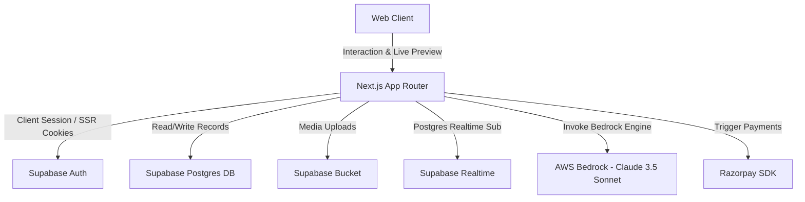

# MomentsAI - Turn Memories Into Beautiful Websites

MomentsAI is a production-ready, premium SaaS platform that allows users to create deeply personal, emotional, and stunning websites for special life milestones like birthdays, anniversaries, proposals, friendships, graduations, and farewells in minutes.

Built with design standards inspired by Apple, Stripe, and Linear, the platform leverages **Next.js (App Router)**, **Supabase**, **Amazon Bedrock (Claude 3.5 Sonnet)**, and **Framer Motion** to assemble ultra-premium, responsive web showcases.

---

### 🌐 Live Deployment
**Production Link**: [https://main.d1b1qnz53c4sbl.amplifyapp.com/](https://main.d1b1qnz53c4sbl.amplifyapp.com/)

---

### 📊 Badges
[](LICENSE)
[](https://github.com/Nandansai08/momentsAi/actions)
[](https://github.com/Nandansai08/momentsAi/issues)
[](CONTRIBUTING.md)
[](docs/good_first_issues.md)

---

## 📸 Screenshots Section

### 🌌 Visual Design Redesign (Light-theme first)
*Redesigned landing page with radial ambient glows, Outfit typography, and responsive interactive mockup previews.*

```
+-------------------------------------------------------------+
|  Sparkles MomentsAI                 Dashboard  Sign In      |
+-------------------------------------------------------------+
|                                                             |
|             Create Emotional Visual Showcases               |
|            for Anniversaries, Birthdays & Milestones        |
|                                                             |
|           [ Get Started Free ]     [ Watch Demo ]           |
|                                                             |
|         +-----------------------------------------+         |
|         |  [Live Interactive Device Preview Mock] |         |
|         |  - Romantic Theme   - Celestial Theme   |         |
|         |  - Cute theme       - Minimal Slate     |         |
|         +-----------------------------------------+         |
+-------------------------------------------------------------+
```

---

## 🚀 Key Features

* **Stepped Website Generator**: A highly interactive, fully animated 5-step wizard to guide users through compiling occasions, entering personal highlights, and selecting themes.
* **Real-time Live Preview**: Side-by-side editing panel that renders live changes as you modify letter content, music options, images, and visual themes.
* **Claude 3.5 Sonnet AI Engine**: Invokes Amazon Bedrock to write emotional personal letters, timelines, quotes, poems, and creative captions.
* **Dynamic Theme Preset Cards**: Beautifully styled templates matching *Romantic Rose (Sakura petals), Cosmic Celestial (Gold-gilded starfield), Modern Minimal (Slate), Luxury Gold (Premium border), and Cute Pastel (Bouncy widgets)* theme configurations.
* **Virtual Wax-Sealed Letters**: Elegant envelopes with realistic breaking wax-seal animations that slide open to display the personal letter.
* **Music Vinyl Player**: A vintage custom-styled vinyl disc that spins in real-time as background acoustic soundtracks play!
* **Memory Journey Timeline**: An interactive vertical connector line showing beautiful scroll-reveal animations.
* **Guestbooks & Emoji Reactions**: Let visitors write well-wishes and click floating emojis (hearts, likes, confetti) that animate live.
* **Password Locks & Timers**: Add password protections or scheduled reveal timers to keep moments intimate until the big day.
* **Admin Moderation & Analytics Panel**: Monitor views, unique visitors, devices, traffic origins, and ban/flag websites violating terms.

---

## 🛠️ Tech Stack

* **Frontend**: Next.js (App Router), TypeScript, Tailwind CSS, Lucide Icons, Framer Motion
* **Backend**: Supabase (PostgreSQL, Auth, RLS, Real-time triggers)
* **AI Engine**: AWS Bedrock Client (Claude 3.5 Sonnet)
* **Payments**: Razorpay (Pre-wired subscription hooks, unlocked as free sandbox for local testing)

---

## 📐 System Architecture

Below is a conceptual architecture diagram outlining the interaction model:



Detailed architectural breakdowns can be found in the [Architecture Documentation](docs/architecture.md).

---

## ⚙️ Local Development Setup

To boot the project locally, please ensure you have **Node.js 18+** and **npm** installed.

### 1. Clone the project and install packages:
```bash
git clone https://github.com/Nandansai08/momentsAi.git
cd momentsAi
npm install
```

### 2. Configure Environment Variables:
Copy `.env.example` to `.env.local` and input your keys:
```bash
# Add your local or production URLs:
NEXT_PUBLIC_APP_URL=http://localhost:3001

# Add your Supabase parameters:
NEXT_PUBLIC_SUPABASE_URL=https://dwrankzjpvdqorkwbgdf.supabase.co
NEXT_PUBLIC_SUPABASE_ANON_KEY=your-anonymous-key
SUPABASE_SERVICE_ROLE_KEY=your-service-role-key

# Add AWS credentials with Bedrock access (Optional - falls back to developer simulation if empty!):
AWS_ACCESS_KEY_ID=your-aws-access-key-id
AWS_SECRET_ACCESS_KEY=your-aws-secret-access-key
AWS_REGION=us-east-1
```
*For detailed explanation of all environmental settings, read our [Setup Guide](docs/setup.md).*

### 3. Deploy Database Schema in Supabase:
Create a project on Supabase and run the SQL schema:
1. Copy the contents of the database schema file: [supabase/schema.sql](file:///c:/Users/nanda/momentsAi/supabase/schema.sql).
2. Paste and run it inside the **SQL Editor** of your Supabase project dashboard.
3. This creates all tables (Profiles, Moments, Themes, Guestbooks, Analytics), enables Row Level Security (RLS) policies, and hooks up the database trigger for sync'ing signups.

### 4. Run the Sandbox Studio:
Run the development build server locally:
```bash
npm run dev
```
Open **[http://localhost:3001](http://localhost:3001)** in your browser to experience MomentsAI!

---

## 🔒 Security & Row Level Security (RLS)

* **Profiles**: Users can read public profiles but can only edit/modify their own profile.
* **Moments**: Public visitors can read a moment only if `is_published = true`. Creators have full CRUD permissions over their own created slug entries.
* **Guestbooks**: Any visitor can write a guestbook entry for a published moment. Only the moment creator can moderate (approve/delete) entries.
* **Analytics**: Visitor views are updated via secure PostgreSQL Remote Procedure Calls (`increment_moment_views`), preventing direct table alterations from browsers.
* See [SECURITY.md](SECURITY.md) for vulnerability disclosure policies.

---

## 🗺️ Product Roadmap

* **Phase 1: Foundation**: Stepped Wizard, Responsive Visual Themes, Core Auth.
* **Phase 2: Social & Customization**: Guestbook Moderation, Audio Uplink, visit analytics.
* **Phase 3: AI Extensions & domains**: AI Timeline Generator, custom domain mappings.
* **Phase 4: White-labeling**: Mobile applications, multi-member collaboration workspace, white-label branding.
* Read the full roadmap breakdown in [Roadmap Documentation](docs/roadmap.md).

---

## 🤝 Contribution Guidelines

We love pull requests! Please read our [CONTRIBUTING.md](CONTRIBUTING.md) to understand our:
* Branch naming and Conventional Commit specifications.
* Coding standards and folder structures.
* Check out the [Good First Issues Directory](docs/good_first_issues.md) for 30 beginner-friendly tasks!

---

## 📄 License
This project is licensed under the terms of the MIT License. See [LICENSE](LICENSE) for details.
