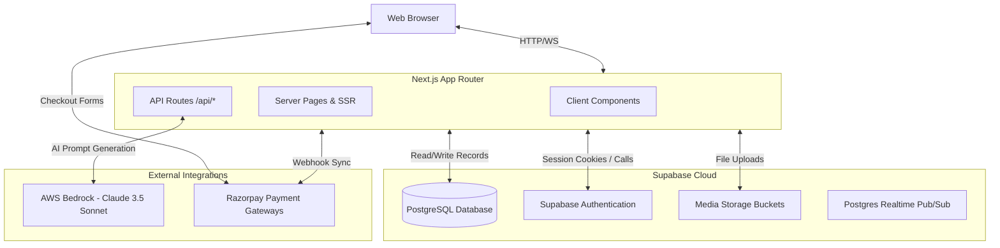

# MomentsAI Architecture Documentation

This document describes the high-level architecture, database schema, directory design, and external integration points of the MomentsAI platform.

---

## 1. System Overview

MomentsAI is a serverless SaaS platform built on **Next.js (App Router)** and **Supabase (Postgres-as-a-Service)**. It lets creators compile milestones and media into visual web showcases, backed by AI-generated emotional stories.

---

## 2. Directory Layout & Roles

The codebase is structured under the `src/` folder:

* **`src/app/`**: App Router page components and API endpoints.
  * **`(auth)/`**: Handles User accounts (Sign In, Sign Up, Password Resets).
  * **`(dashboard)/`**: User workspaces (Website lists, Billing profiles, visit Analytics, Admin panel).
  * **`(generator)/`**: Stepped creation wizard with live preview edit state.
  * **`m/[slug]/`**: Core Render engine for public and private moment websites.
  * **`api/`**: Serverless endpoints (AI text generation, payment verify, guestbook posting).
* **`src/components/`**: Modular, reusable React components.
  * **`marketing/`**: Landing page hero sections, footers, navigation, and mockup previews.
* **`src/lib/`**: Business logic helpers.
  * **`supabase/`**: Cookie-based Supabase client wrappers for server, client, and middleware contexts.
  * **`bedrock/`**: AWS Bedrock invoke commands.
  * **`razorpay/`**: Signature hash verifications.
* **`supabase/`**: Contains database schema scripts (`schema.sql`).

---

## 3. Database Modeling & Row Level Security (RLS)

MomentsAI leverages Supabase PostgreSQL tables. Security is strictly enforced at the database layer using Row Level Security (RLS).

### Tables Overview
1. **`profiles`**: Stores user data synced automatically from `auth.users` via triggers.
2. **`moments`**: Stores the milestone site metadata (slug, title, event date, song slug, template configurations).
3. **`themes`**: Contains styling presets (colors, fonts, borders, layouts).
4. **`guestbooks`**: Captures visitor greetings, wishes, and names.
5. **`analytics`**: Logs hourly and daily visits, country tags, and device types.
6. **`subscriptions`**: Controls Pro features according to Razorpay sync hooks.

### Core RLS Policies
* **Public Visibility**: The `moments` table has a policy allowing read (`SELECT`) access to anyone, **provided** `is_published = true` and `reveal_date <= NOW()`. This ensures schedules are respected.
* **Creator Ownership**: Creation, updates, and deletions on `moments` and `profiles` require the user session ID to match the owner's `user_id`.
* **Open Guestbooks**: Anyone can submit a guestbook message (`INSERT`) for a published moment. However, only the moment creator can delete (`DELETE`) or moderate them.

---

## 4. AI Engine: AWS Bedrock & Claude 3.5 Sonnet

MomentsAI uses **Claude 3.5 Sonnet** (via Amazon Bedrock) to co-write emotional letters, timelines, and greetings.

1. **System Prompt**: Enforces warm, highly empathetic tone styles, avoiding boilerplate robotic output.
2. **Fallback Simulation**: If AWS credentials are not set in the local environment, the client falls back to a realistic generator helper. This lets contributors build features locally without requiring AWS account provisioning.
